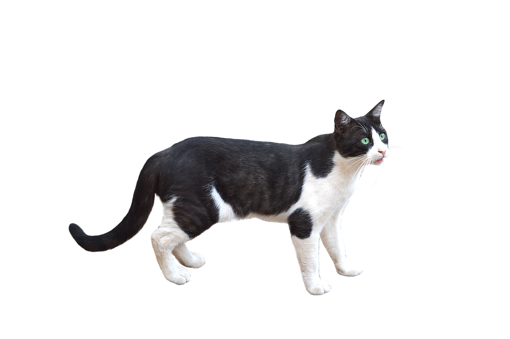
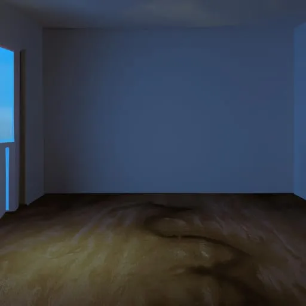

# Neolocus API

This is an image processing API in Python Flask that increases the brightness of every received image by 30%.

## Deploy API server
1. clone this project from Github
```bash
git clone https://github.com/badbubble/NeolocusAPI.git
```
2. Modify settings as need in `NeolocusAPI/app/config/settings.py`
```python
class Config:
    DEBUG = False  # debug mode
    INCREASE_BRIGHTNESS_RATE = 1.3  # increase rate
    DEFAULT_IMG_TYPE = 'PNG'  # default type of image
    MAX_IMG_SIZE = 5 * 1024 * 1024  # max image size 5MB
    MIN_IMG_SIZE = 0 * 1024  # min image size 10KB
```
3. Use Docker deploy it(recommend)
```bash
docker build -t neolocusapi .
docker run -d -p 8080:8080 neolocusapi
```
4. Or use pip to install requirements to run it locally.
```bash
pip install -r requirements.txt
gunicorn --workers=3 --bind=0.0.0.0:8080 main:app
```


## Test by client.py

1. install requirements
```bash
pip install -r client_requirements.txt
```

2. execute client.py with image path and image saved path

```bash
python3 client.py --ip <ip_address> --port <port_number> --img_path <path_to_input_image> --save_path <path_to_output_image>
```
example:
```bash
python3 client.py --ip 0.0.0.0 --port 8080 --img_path test_images/bedroom.png --save_path result_images/bedroom.png
```


## Features
### Redprint for endpoints


Create a Redprint class from a Blueprint class. 
Similar to a Blueprint, a Redprint helps developers decompose a large Flask application into smaller,
manageable, and reusable components. Each 'redprint' focuses on a specific feature or aspect of the application.
For example, use api = Redprint("image") to define a module for image handling.
This approach simplifies routing; instead of repeatedly writing @api.route("/v1/image/upload"), 
a developer can simply use @api.route("upload").

```python
class Redprint:
    def __init__(self, name: str) -> None:
        self.name = name
        self.mound = []

    def route(self, rule, **options) -> Callable:
        def decorator(f: Callable) -> Callable:
            self.mound.append((f, rule, options))
            return f
        return decorator

    def register(self, bp: Blueprint, url_prefix: Optional[str] = None) -> None:
        if url_prefix is None:
            url_prefix = '/' + self.name
        for f, rule, options in self.mound:
            endpoint = self.name + '+' + \
                       options.pop("endpoint", f.__name__)
            bp.add_url_rule(url_prefix + rule, endpoint, f, **options)

```
### Uniform Response Format

In this API project, every handler should return an APIException instead of a direct JSON result.
The APIException is a structured JSON response that includes the endpoint the client requested,
a message, an error code, and the HTTP status code. This standardizes the error handling across the application
by providing consistent and informative message or error responses.

Developers or clients can use the following table to determine what happend to their requests and do a more specific operation.

| APIException    | HTTP Status Code | Error code | Message format                                                                                                  | Description                              |
|-----------------|------------------|------------|-----------------------------------------------------------------------------------------------------------------|------------------------------------------|
| Success         | 200              | 0          | {"error_code": 0, "msg":{"image":"IMG_BASE64"}, "request": REQUEST_METHOD and ENDPOINT}                         | Handler successfully processed a request |
| ParameterException | 200              | 101        | {"error_code": 101, "msg":{"image":"WHATS WORNG WITH image PARAMETER"}, "request": REQUEST_METHOD and ENDPOINT} | Client's input is invalid                                                               |
|  ServerError    | 500              | 1000       | {"error_code": 1000, "msg":{"error":[A LIST OF ERRORS]}, "request": REQUEST_METHOD and ENDPOINT}                | Other errors                                                                                                     |

### Return Exception when meet with invalid parameters
Rewrite `wtforms.Form` to process requested data within validators and return ParameterException directly
if there is an invalid parameters instead of process it in handler.
```python
class BaseForm(Form):
    def __init__(self):
        data = request.get_json(silent=True)
        args = request.args.to_dict()
        super(BaseForm, self).__init__(data=data, **args)

    def validate_for_api(self):
        valid = super(BaseForm, self).validate()
        if not valid:
            raise ParameterException(msg=self.errors)
        return self
```

## Project Overview
```bash
├── Dockerfile
├── README.md
├── app  # 
│   ├── __init__.py
│   ├── api
│   │   ├── __init__.py
│   │   └── v1
│   │       ├── __init__.py
│   │       └── image.py  # image handlers
│   ├── app.py  # create Flask app
│   ├── config
│   │   ├── __init__.py
│   │   └── settings.py  # setting files
│   ├── error
│   │   ├── __init__.py
│   │   ├── error.py
│   │   └── error_code.py
│   ├── internal
│   │   ├── __init__.py
│   │   └── image.py
│   ├── libs
│   │   ├── __init__.py
│   │   └── redprint.py
│   └── validators
│       ├── __init__.py
│       ├── base.py
│       └── image.py
├── client.py
├── main.py
├── test_main.py
└── test_images
    ├── bedroom.png
    ├── bedroom_brighter.png
    ├── brighter_cat.png
    └── cat.png

```


## Tests
test cases in `test_app.py`

| Test function | Description                     |
|---------------|---------------------------------|
|test_invalid_param_big_img| test posting a very big image   |
|test_invalid_param_small_img| test posting a very small image |
|test_invalid_param_empty_img| test posting an empty image     |
|test_png_img| test posting a png image        |
|test_jpg_img| test posting a jpg image        |
|test_abnormal_img| test posting an invalid image   |
### Image result

| Original                     | Increase brightness            |
|------------------------------|--------------------------------|
|      |      |
|      |      |
|  |  |

## Performance analysis and next step